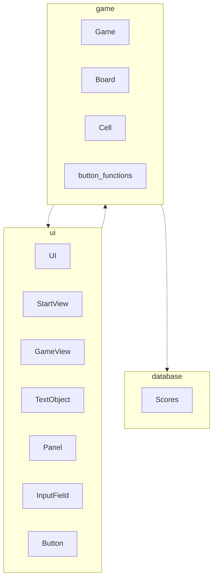
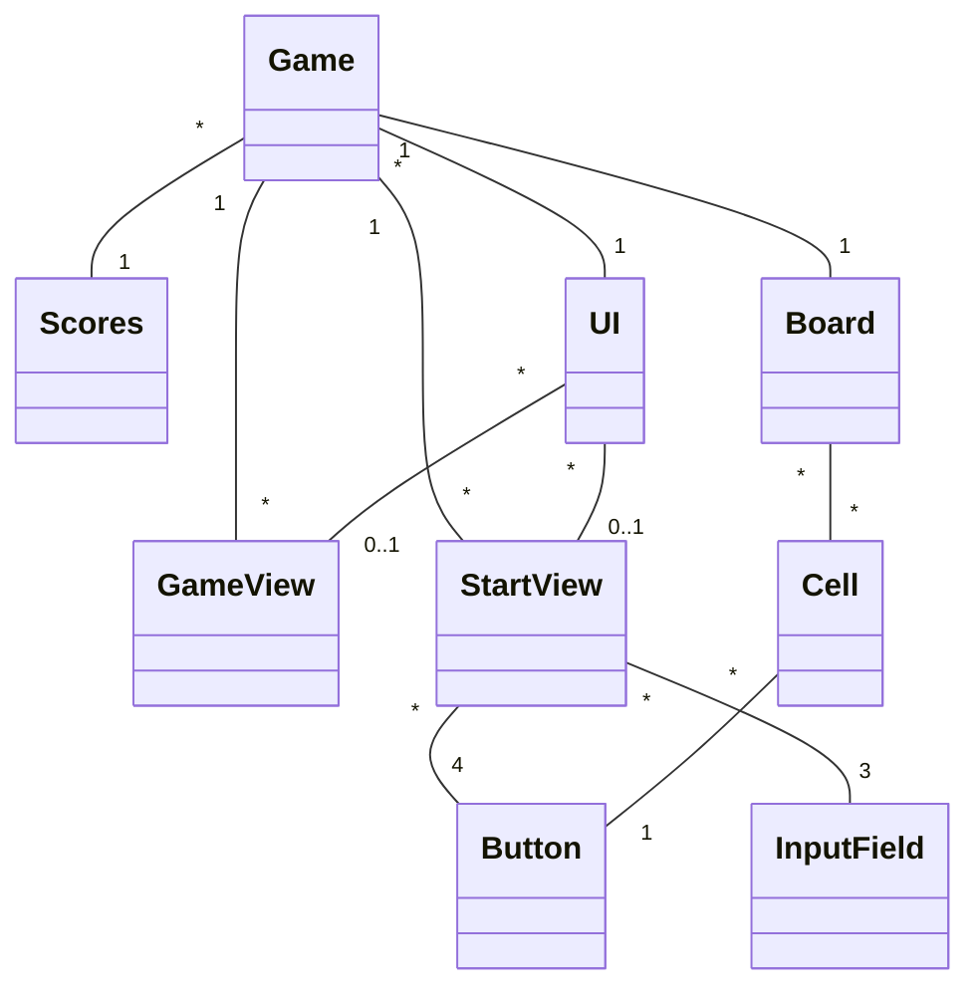
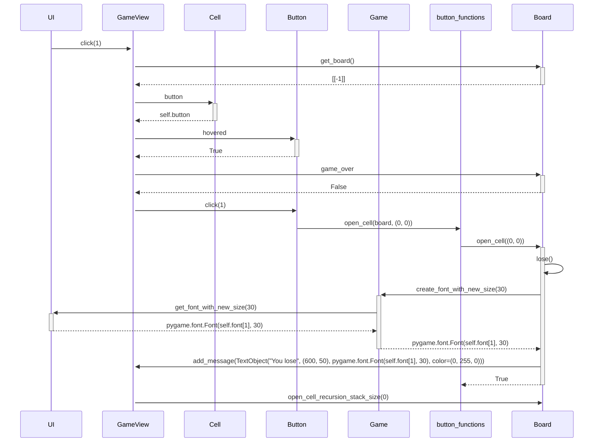
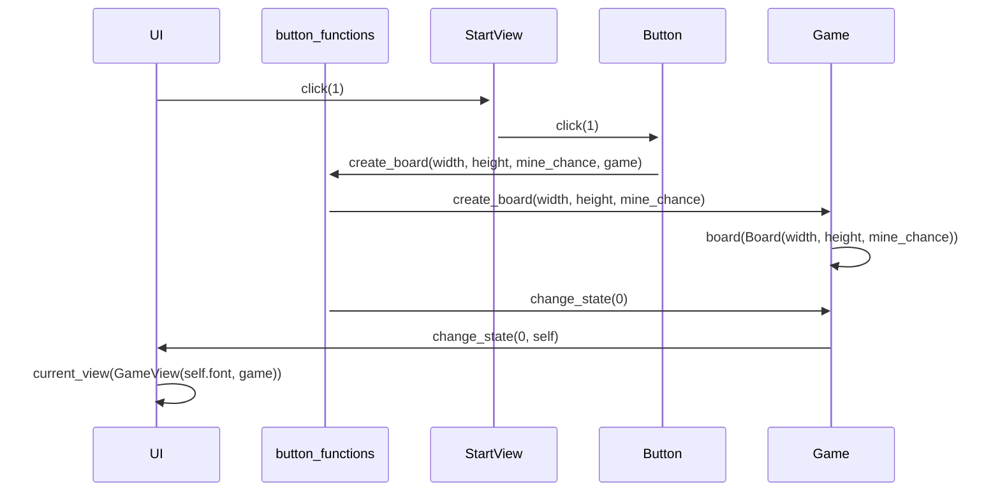

# Arkkitehtuuri
## Rakenne
Sovelluksen pakkausrakenne nähdään alla olevasta flowchartista.



Luokkakaavio on seuraavanlainen:



Luokka Game hallitsee Käyttöliittymää, tietokantaa ja sovelluslogiikkaa.
## Käyttöliittymä
Sovelluksen käyttöliittymää hallitsee luokka ```UI```. Luokalla UI on attribuutti ```__current_view```, mikä saa arvokseen aina toisen kahdesta näkymästä: ```StartView```, joka vastaa pelilaudan luomisesta ja ```GameView```, joka renderöi pelaajalle pelilaudan.

Näkymien välillä liikutaan luokan UI metodilla ```change_state(state, game)```, missä ```state = 0``` on GameView ja ```state = 1``` on StartView.

Luokille GameView ja StartView injektoidaan olio Game.

## Sovelluslogiikka
Sovelluksen logiikan muodostavat luokat Board ja Cell. Moduuli button_functions antaa nimensä mukaan toiminnallisuuksia napeille.

Oliolla board on attribuutti ```__board```, joka on matriisi Cell olioita.

Sovelluslogiikkaa hallitsee luokka Game.
## Sovelluksen toiminnallisuudet
Alla on skenaario yhden pelilaudan ruudun klikkaamisesta.



Pelilaudan luominen:


