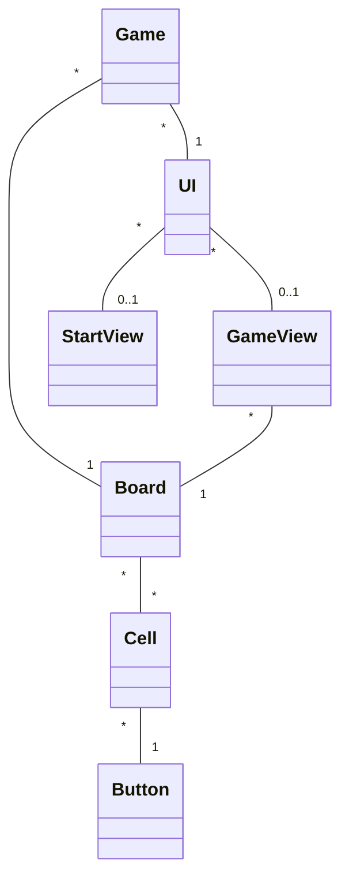
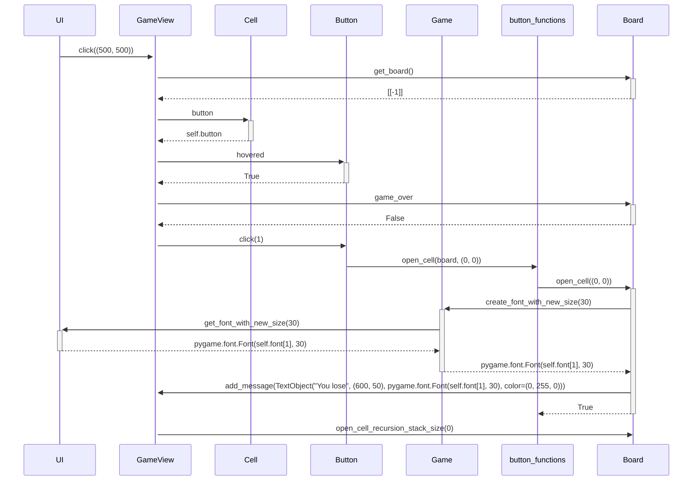

Class diagram

```mermaid
classDiagram
  Game "*" -- "1" UI
  Game "*" -- "1" Board
  Board "*" -- "*" Cell
  Cell "*" -- "1" Button
  UI "*" -- "0..1" GameView
  UI "*" -- "0..1" StartView
  GameView "*" -- "1" Board
```
Scenario for opening a cell after clicking

```mermaid
sequenceDiagram
  participant UI
  participant GameView
  participant Cell
  participant Button
  participant Game
  participant button_functions
  participant Board
  UI ->>+ GameView : click((500, 500))
  GameView ->>+ Board : get_board()
  Board -->>- GameView : [[-1]]
  GameView ->>+ Cell : button
  Cell -->>- GameView : self.button
  GameView ->>+ Button : hovered
  Button -->>- GameView : True
  GameView ->>+ Board : game_over
  Board -->>- GameView : False
  GameView ->> Button : click(1)
  Button ->> button_functions : open_cell(board, (0, 0))
  button_functions ->>+Board : open_cell((0, 0))
  Board ->>+Game : create_font_with_new_size(30)
  Game ->>+ UI : get_font_with_new_size(30)
  UI -->>- Game : pygame.font.Font(self.font[1], 30)
  Game -->>- Board : pygame.font.Font(self.font[1], 30)
  Board ->> GameView : add_message(TextObject("You lose", (600, 50), pygame.font.Font(self.font[1], 30), color=(0, 255, 0)))
  Board -->>- button_functions : True
  GameView ->> Board : open_cell_recursion_stack_size(0)
```
