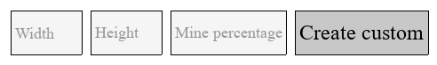
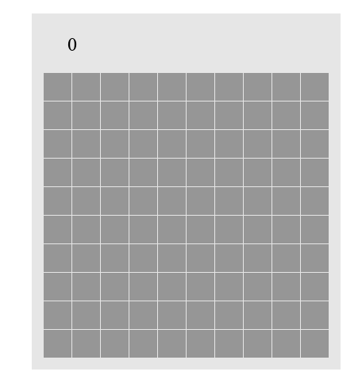
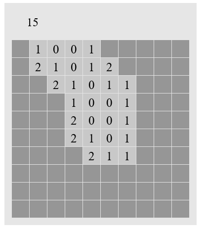
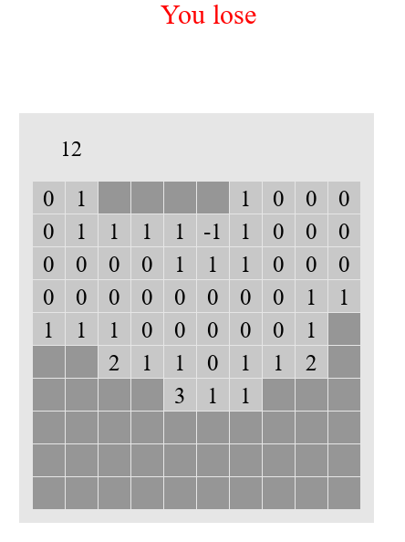
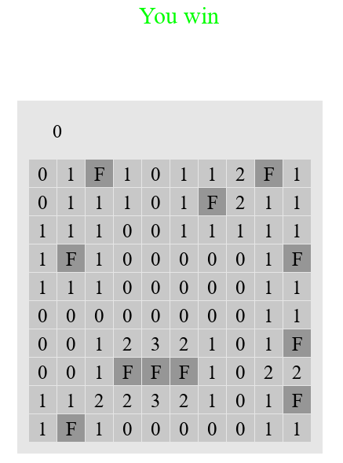
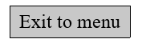
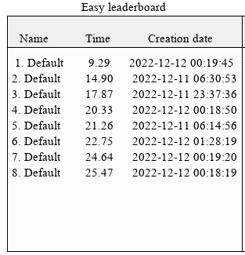

# Käyttöohje
## Ohjelman käynnistäminen
* Lataa ensin riippuvuudet komennolla
```
poetry install
```
* Käynnistä ohjelma komennolla
```
poetry run invoke start
```
## Pelilaudan vaikeustason valitseminen
Voit valita yhden kolmesta oletuspelilaudasta klikkaamalla yhtä napeista "Easy", "Medium" tai "Hard".


Vaihtoehtoisesti voit luoda oman vaikeustason



Kirjoita syötekenttään "width" pelilaudan leveys (1-50). Kirjoita syötekenttään "height" pelilaudan korkeus (1-30).
Kirjoita syötekenttään "mine percentage" miinojen syntymisen prosenttimahdollisuus (0-100). Näiden jälkeen klikkaa nappulaa "Create custom".

## Pelilaudan käyttö


Peli alkaa klikkaamalla yhtä pelilaudan harmaista ruuduista. Klikkaamalla ruutua, ruutu avautuu ja paljastaa numeron.
Numero kertoo ympärillä olevien miinojen määrän (vaakasuorassa, pystysuorassa ja diagonaalisesti).
Jos ruutu on 0, peli avaa automaattisesti kaikki tämän ympärillä olevat ruudut.



Jos avaat miinan, häviät. Miinoja kuvataan pelissä numerolla -1.



Voit klikata piilotettua ruutua hiiren oikealla näppäimellä. Tämä merkkaa ruudun lipulla. Merkattua ruutua näytetään kirjaimella F.

Voit myös klikata jos avattua ruutua. Tämä avaa kaikki sen ympärillä olevat merkkaamattomat piilotetut ruudut, jos sen ympärillä olevia ruutuja on merkattu tarpeeksi.

Jos avaat kaikki ruudut, missä ei ole miinaa, voitat pelin.



Voit poistua takaisin aloitusnäkymään klikkaamalla vasemmassa yläkulmassa olevaa nappulaa "Exit to menu".



## Tulostaulut
Aloitusnäkymän alakulmassa on jokaiselle oletuspelilaudalla oma tulostaulu. Näihin on järjestetty pelikerrat ajalla nopeimmasta hitaimpaan.
Tulokset ovat lokaaleja, jonka vuoksi ensimmäisellä pelikerralla tulostaulut ovat tyhjiä.


