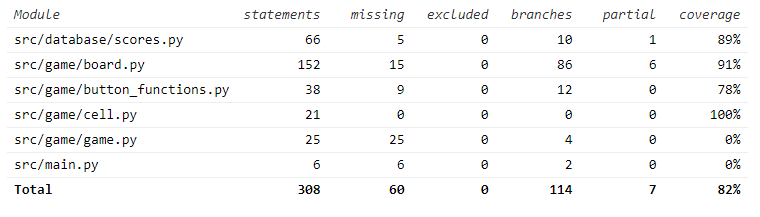

# Testausdokumentti
## Automatisoidut testit
Sovelluksen luokka Board on testattu luokalla TestBoard ja moduuli button_functions on testattu luokalla TestButtonFunctions.

Tietokantaa hallitsevaa luokkaa Scores on testattu luokalla TestScores. Testit luovat testitietokannan testien alkaessa ja poistavat sen testien päätyttyä.

## Testikattavuus

Testaamatta jäi moduulit game.py ja main.py.

## Järjestelmätestaus
Sovelluksen kaikki toiminnallisuudet on pyritty testaamaan kaikilla käyttäjän syötöillä. Testit ovat tehty Windows ja Linux käyttöjärjestelmillä.

Testattu syöttökenttiä mahdollisimman monilla syötteillä.

Testattu tilanteet, missä tietokantatiedosto on tai ei ole olemassa.
